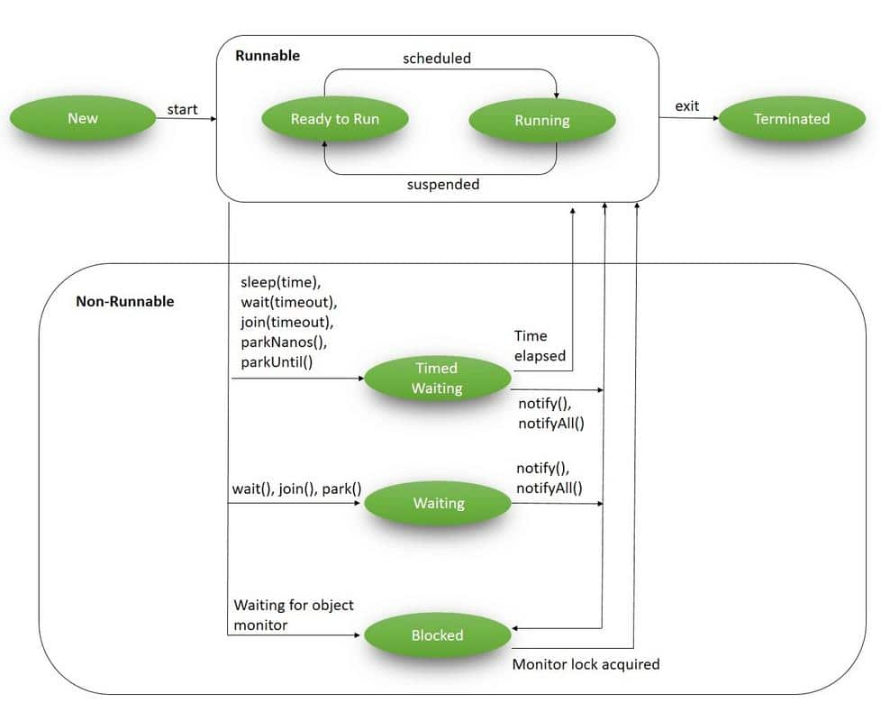

# Ciclo di Vita di un Thread

## Introduzione

In Java, un thread attraversa diversi stati durante la sua esistenza. Comprendere questi stati e come un thread passa da uno all'altro è fondamentale per scrivere applicazioni multi-thread efficaci e prive di errori.

## Stati di un Thread

Secondo la documentazione ufficiale di Java, un thread può trovarsi in uno dei seguenti stati:

1. **New (Nuovo)**: Il thread è stato creato ma non è ancora stato avviato.
2. **Runnable (Eseguibile)**: Il thread è in esecuzione o pronto per essere eseguito quando gli viene assegnato del tempo di CPU.
3. **Blocked (Bloccato)**: Il thread è temporaneamente inattivo perché sta attendendo un monitor lock.
4. **Waiting (In Attesa)**: Il thread è temporaneamente inattivo perché un altro thread ha eseguito un'azione specifica.
5. **Timed Waiting (In Attesa Temporizzata)**: Il thread è temporaneamente inattivo per un periodo di tempo specificato.
6. **Terminated (Terminato)**: Il thread ha completato la sua esecuzione.

### Diagramma degli Stati

```
    +-------+                               +----------+
    |  New  |-----> start() ------------->  | Runnable | <---+
    +-------+                               +----------+     |
                                                |  ^         |
                                                |  |         |
                                                |  +---------+
                                                |    yield() |
                                                v            |
    +------------+    +----------+    +----------+           |
    | Terminated | <--+ Blocked  | <--+  Waiting |           |
    +------------+    +----------+    +----------+           |
           ^               ^               ^                 |
           |               |               |                 |
           +---------------+---------------+-----------------+
                          run() completes
```

[](https://www.baeldung.com/java-thread-lifecycle) 


## Transizioni tra Stati

### Da New a Runnable

Un thread passa dallo stato New a Runnable quando viene chiamato il metodo `start()`.

```java
Thread thread = new Thread(() -> System.out.println("Hello")); // Stato: New
thread.start(); // Transizione a Runnable
```

### Da Runnable a Blocked

Un thread passa da Runnable a Blocked quando tenta di acquisire un monitor lock che è già posseduto da un altro thread.

```java
synchronized(oggetto) {
    // Codice sincronizzato
    // Se un altro thread possiede già il lock su 'oggetto',
    // questo thread passerà allo stato Blocked
}
```

### Da Runnable a Waiting

Un thread passa da Runnable a Waiting quando:

1. Chiama `Object.wait()` su un oggetto
2. Chiama `Thread.join()` su un altro thread
3. Chiama `LockSupport.park()`

```java
synchronized(oggetto) {
    try {
        oggetto.wait(); // Il thread passa allo stato Waiting
    } catch (InterruptedException e) {
        // Gestione dell'eccezione
    }
}
```

### Da Runnable a Timed Waiting

Un thread passa da Runnable a Timed Waiting quando:

1. Chiama `Thread.sleep(timeout)`
2. Chiama `Object.wait(timeout)` su un oggetto
3. Chiama `Thread.join(timeout)` su un altro thread
4. Chiama `LockSupport.parkNanos()` o `LockSupport.parkUntil()`

```java
try {
    Thread.sleep(1000); // Il thread passa allo stato Timed Waiting per 1 secondo
} catch (InterruptedException e) {
    // Gestione dell'eccezione
}
```

### Da Waiting/Timed Waiting a Runnable

Un thread torna allo stato Runnable quando:

1. Un altro thread chiama `notify()` o `notifyAll()` sull'oggetto su cui il thread ha chiamato `wait()`
2. Il thread su cui è stato chiamato `join()` termina
3. Il thread viene interrotto
4. Il timeout specificato scade (per Timed Waiting)

### Da Runnable a Terminated

Un thread passa allo stato Terminated quando:

1. Il metodo `run()` completa la sua esecuzione
2. Viene lanciata un'eccezione non gestita all'interno del metodo `run()`

## Metodi per Controllare il Ciclo di Vita

### start()

Avvia l'esecuzione del thread, chiamando il metodo `run()`.

```java
Thread thread = new Thread(() -> System.out.println("Thread avviato"));
thread.start(); // Avvia il thread
```

### sleep(long millis)

Mette il thread corrente in pausa per il numero specificato di millisecondi.

```java
try {
    Thread.sleep(2000); // Pausa di 2 secondi
} catch (InterruptedException e) {
    // Gestione dell'interruzione
}
```

### join()

Attende che il thread su cui viene chiamato termini.

```java
Thread thread = new Thread(() -> {
    // Codice del thread
});
thread.start();

try {
    thread.join(); // Attende che 'thread' termini
} catch (InterruptedException e) {
    // Gestione dell'interruzione
}

// Questo codice verrà eseguito solo dopo che 'thread' è terminato
```

### yield()

Suggerisce allo scheduler di dare la possibilità ad altri thread di eseguire. Non c'è garanzia che questo suggerimento venga seguito.

```java
Thread.yield(); // Suggerisce allo scheduler di passare ad altri thread
```

### interrupt()

Interrompe un thread. Se il thread è in attesa (tramite `sleep()`, `wait()` o `join()`), verrà lanciata un'eccezione `InterruptedException`.

```java
Thread thread = new Thread(() -> {
    try {
        Thread.sleep(10000); // Pausa di 10 secondi
    } catch (InterruptedException e) {
        System.out.println("Thread interrotto");
    }
});
thread.start();

// Dopo un po'...
thread.interrupt(); // Interrompe il thread
```

## Priorità dei Thread

In Java, ogni thread ha una priorità che può influenzare la frequenza con cui viene eseguito rispetto ad altri thread. La priorità è un valore intero compreso tra `Thread.MIN_PRIORITY` (1) e `Thread.MAX_PRIORITY` (10), con un valore predefinito di `Thread.NORM_PRIORITY` (5).

```java
Thread thread = new Thread(() -> {
    // Codice del thread
});
thread.setPriority(Thread.MAX_PRIORITY); // Imposta la massima priorità
thread.start();
```

È importante notare che le priorità dei thread sono suggerimenti per lo scheduler e non garantiscono un ordine specifico di esecuzione. Il comportamento può variare tra diverse implementazioni della JVM e sistemi operativi.

## Daemon Thread

In Java, i thread possono essere classificati come daemon o non-daemon. Un daemon thread è un thread di servizio che viene eseguito in background e non impedisce alla JVM di terminare quando tutti i thread non-daemon sono terminati.

```java
Thread daemonThread = new Thread(() -> {
    while (true) {
        // Operazione continua
        try {
            Thread.sleep(1000);
        } catch (InterruptedException e) {
            break;
        }
    }
});
daemonThread.setDaemon(true); // Imposta come daemon thread
daemonThread.start();

// La JVM terminerà anche se questo thread è ancora in esecuzione,
// a condizione che tutti gli altri thread non-daemon siano terminati
```

## Best Practices

1. **Gestire sempre le InterruptedException**: Non ignorare mai queste eccezioni, ma gestirle appropriatamente.

2. **Evitare l'uso di stop(), suspend() e resume()**: Questi metodi sono deprecati perché possono causare problemi di sicurezza e deadlock.

3. **Usare timeouts**: Quando si utilizzano metodi come `wait()` o `join()`, considerare l'uso delle versioni con timeout per evitare blocchi indefiniti.

4. **Controllare l'interruzione**: Nei cicli lunghi, controllare periodicamente lo stato di interruzione del thread.

```java
while (!Thread.currentThread().isInterrupted()) {
    // Operazioni del ciclo
}
```

5. **Chiudere correttamente le risorse**: Assicurarsi che tutte le risorse vengano rilasciate correttamente quando un thread termina.

## Esempi Pratici

### Esempio 1: Utilizzo di sleep()

```java
public class SleepExample {
    public static void main(String[] args) {
        Thread thread = new Thread(() -> {
            for (int i = 0; i < 5; i++) {
                System.out.println("Conteggio: " + i);
                try {
                    Thread.sleep(1000); // Pausa di 1 secondo
                } catch (InterruptedException e) {
                    System.out.println("Thread interrotto");
                    return;
                }
            }
        });
        
        thread.start();
        System.out.println("Thread principale continua l'esecuzione");
    }
}
```

### Esempio 2: Utilizzo di join()

```java
public class JoinExample {
    public static void main(String[] args) {
        Thread thread = new Thread(() -> {
            System.out.println("Thread secondario inizia");
            try {
                Thread.sleep(3000); // Simula un'operazione lunga
            } catch (InterruptedException e) {
                e.printStackTrace();
            }
            System.out.println("Thread secondario termina");
        });
        
        thread.start();
        System.out.println("Thread principale attende il completamento del thread secondario");
        
        try {
            thread.join(); // Attende che il thread termini
        } catch (InterruptedException e) {
            e.printStackTrace();
        }
        
        System.out.println("Thread principale continua dopo il completamento del thread secondario");
    }
}
```

### Esempio 3: Interruzione di un Thread

```java
public class InterruptExample {
    public static void main(String[] args) {
        Thread thread = new Thread(() -> {
            try {
                System.out.println("Thread inizia e va in sleep");
                Thread.sleep(10000); // Pausa di 10 secondi
                System.out.println("Sleep completato"); // Non verrà eseguito se interrotto
            } catch (InterruptedException e) {
                System.out.println("Thread interrotto durante il sleep");
                return; // Esce dal thread
            }
        });
        
        thread.start();
        
        try {
            Thread.sleep(2000); // Attende 2 secondi
        } catch (InterruptedException e) {
            e.printStackTrace();
        }
        
        System.out.println("Interruzione del thread");
        thread.interrupt(); // Interrompe il thread
    }
}
```

Nel prossimo capitolo, esploreremo i meccanismi di sincronizzazione in Java, fondamentali per gestire l'accesso concorrente alle risorse condivise tra thread.

## Navigazione del Corso
- [📑 Indice](../README.md)
- [⬅️ Creazione di Thread](./02-CreazioneThread.md)
- [➡️ Sincronizzazione](../02-Sincronizzazione/README.md)